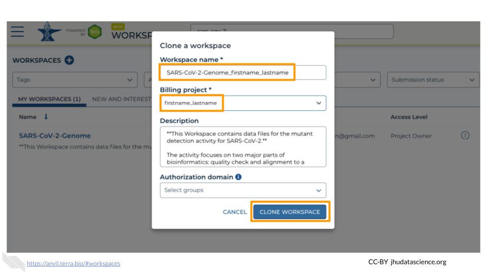
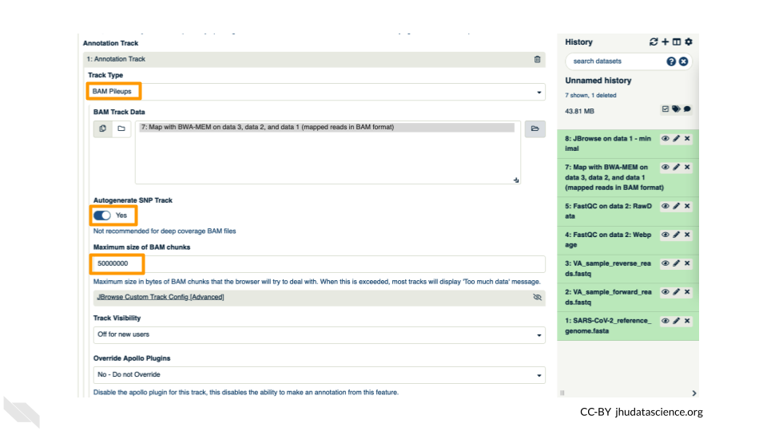
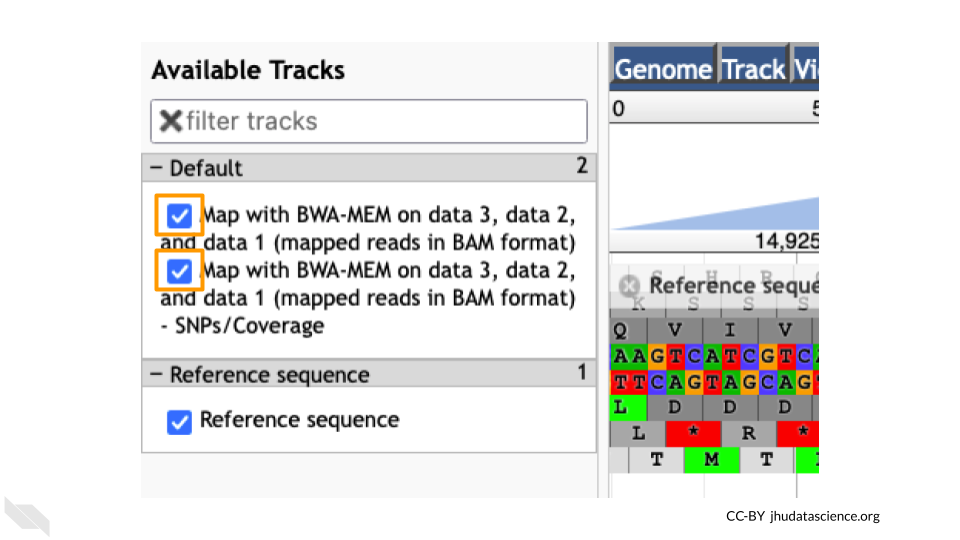

# Student Activity Guide

This chapter contains the student instructions for the SARS-CoV-2 Variant Detection with Galaxy activity.

## Introduction

Galaxy is a free, relatively easy to use bioinformatics implementation package. It changes command line programs into GUI based programs.

### Before You Start

Make sure you have an AnVIL account (refer to https://jhudatascience.org/AnVIL_Book_Getting_Started/student-account-setup.html) 

### Objectives

This activity will teach you how to use the AnVIL platform to:

1. Get started working on AnVIL
1. Launch the Galaxy tool
1. Examine fastq sequence data files
1. Align sequence data to a reference genome
1. View the aligned data and reference genomes interactively

## Getting Started

### Set Up

In the next few steps, you will walk through how to get set up to use Galaxy on the AnVIL platform. AnVIL is centered around different “Workspaces”. Each Workspace functions almost like a mini code laboratory - it is a place where data can be examined, stored, and analyzed. The first thing we want to do is to copy or “clone” a Workspace to create a space for you to experiment.

Use a web browser to go to the AnVIL website. In the browser type:

```
anvil.terra.bio
```

After logging in, click “View Workspaces”. Select the “Public” tab. In the top search bar type the activity workspace “SARS-CoV-2-Genome”. You can also go directly to the following link: https://anvil.terra.bio/#workspaces/gdscn-exercises/SARS-CoV-2-Genome. 

Clone the workspace by clicking the teardrop button ({#id .class width=25 height=20px}). And selecting “Clone”.


In the first box, give your Workspace clone a name by adding an underscore (“_”) and your name. For example, “SARS-CoV-2-Genome_Ava_Hoffman”. Next, select the Billing project provided by your instructor. Leave the bottom two boxes as-is and click “CLONE WORKSPACE”.



### Starting Galaxy 

Galaxy is a great tool for performing bioinformatics analysis without having to update software or worry too much about coding. In order to use Galaxy, we need to create a cloud environment. This is like quickly renting a few computers from Google as the engine to power our Galaxy analysis. 

In your new Workspace, click on the “NOTEBOOKS” tab. Next, click on “Create a Cloud Environment for Galaxy”. You should see a popup window on the right side of the screen. Click on “NEXT” and “CREATE” to keep all settings as-is. This will take 8-10 minutes. When it is done, click “LAUNCH GALAXY”.


You can also follow along with the first ~2 minutes of [this video](https://jhudatascience.org/AnVIL_Book_Getting_Started/starting-galaxy.html) to start Galaxy on AnVIL.

### Navigating Galaxy

Notice the three main sections.

**Tools** - These are all of the bioinformatics tool packages available for you to use.

**The Main Dashboard** - This contains flash messages and posts when you first open Galaxy, but when we are using data this is the main interface area.

**History** - When you start a project you will be able to see all of the documents in the project in the history. Now be aware, this can become very busy. Also the naming that Galaxy uses is not very intuitive, so you must make sure that you label your files with something that makes sense to you.


On the welcome page, there are links to tutorials. You may try these out on your own. If you want to try a new analysis this is a good place to start.

### Importing Data into Galaxy

Luckily, we linked to the original data when we cloned our Workspace! We have three files we will need for our activity. These are (1) the reference genome for SARS-CoV-2, and both forward (2) and reverse (3) reads for our sample. There are two sets of reads for our sample because the scientists who collected it used paired-end sequencing. The reference genome ends in “.fasta” because it has already been cleaned up by scientists. The sample we are looking at ends in `fastq` because it is raw data from the sequencer.

1. Click on “Upload Data” in the Tools pane.  

    

2. Click on “Choose remote files” at the bottom of the popup. Double-click the workspace folder, then “Tables/” then “reference/”. Click the reference .fasta file so that it is highlighted in green and click “OK”.

    

3. Now that your reference has been added, click “Choose remote files” again to add the two sample files. Double-click the workspace folder, then “Tables/” then “samples/”. Click the two sample `fastq` files so that they are highlighted in green and click “OK”.

    

4. Click “Start” and once complete, you can click “Close”. 

5. Confirm your upload worked by looking at the file names in the History pane.

    

## Exercise One: Examining `fastq` Files in Galaxy

_Now we have some data in our account we can look at it. In this exercise we will see data in `fastq` format. This is the typical output from an Illumina Sequencer, but also the standard format for most alignment software._

### Examining Inputs

Use your mouse and click on the eye icon ({#id .class width=25 height=20px}) of the first `fastq` file (**VA_sample_forward_reads.fastq**). In the Main screen you will see something like this:


::: {.fyi}
QUESTIONS:

1. How many lines in a .fastq file represent an individual read?

2. What does each line represent?

3. Why is the final line for each read (the quality score) important?
:::

### Quality Scoring

FastQC is a tool which aims to provide simple quality control checks on raw sequence data coming from high throughput sequencing pipelines. It provides a set of analyses which you can use to get a quick impression of whether your data has any problems of which you should be aware before doing any further analysis. 

Find the FastQC tool in the GENOMIC FILE MANIPULATION: FASTQ Quality Control tool folder. You will see something like this in the tools:


In the first drop down menu, make sure it has your first `fastq` file (**VA_sample_forward_reads.fastq**) loaded. Leave everything else as-is and click on the blue execute button at the bottom of the screen. 


The main dash will highlight in green if everything is okay. In the history, you will see the new files turn yellow, then green. If the job fails it will show an error. 

Click on the eye icon ({#id .class width=25 height=20px}) in the new file in the history “FASTQC on data2 Webpage”. 


You will open up a summary report for the sequencing file:


::: {.fyi}
QUESTIONS:

4. Explore “Basic Statistics”. How many total reads are there? Have any been flagged as poor quality? What is the sequence length?

5. Explore “Per base sequence quality”. Based on the Basic Statistics, is 28-40 a good or bad quality score? 

6. Is it okay to proceed based on the per base sequence quality?
:::

::: {.fyi}
**Breakout Box: Learn more about quality scores**

You may be wondering how the fourth line of the .fastq files relates to the quality score above. To save space, the sequencer records an [ASCII character](http://drive5.com/usearch/manual/quality_score.html) to represent scores 0-42. For example 10 corresponds to “+” and 40 corresponds to “I”. FastQC knows how to translate this. This is often called “Phred” scoring.

What does 0-42 represent? These numbers, when plugged into a formula, tell us the probability of an error for that base. This is the formula, where Q is our quality score (0-42) and P is the probability of an error:

Q = -10 log10(P)

Using this formula, we can calculate that a quality score of 40 means only 0.00010 probability of an error!
:::

## Exercise Two: Alignment {#exercise-two}

_Given that our data has passed some quality checks, we will try to align the data to the reference genome. In this case it is simple, a viral genome. A human sequencing project will generate much larger data sets. There are many aligners, but we will start off looking at a simple aligner BWA-MEM. This example uses paired data._ 

We will use our two SARs data files, which are ready for alignment.
**VA_sample_forward_reads.fastq**
**VA_sample_reverse_reads.fastq**

Now go to GENOMICS ANALYSIS: Mapping and select "Map with BWA-MEM". This program will align your reads to your SARS reference genome. Some of our reads are >100 base pairs so we will use the MEM option. 


First, choose your reference. In the first drop down box change it to “Use a genome from history and build index”. Then choose the SARS reference `fasta` file that you uploaded as the reference. 


Under the “Single or Paired-end reads” ensure the “Paired” option is selected. Now choose your forward and reverse fastq files. Leave other options as-is. _You can learn more about what the alignment software BWA-MEM is doing if you scroll down below the execute button_. Click execute.


The output file is a `BAM` file, which lists where each read aligns to the reference genome and whether there are any differences. You can click the eye button to preview the results, but the results are not easy to interpret visually (much like the `fastq` files). Instead you will use a genome viewer in the next step.

::: {.fyi}
QUESTIONS:

7. What is alignment software (for example, BWA-MEM) actually doing?

8. Here we are using paired fastq (“paired end”) data. What is an advantage of using paired data?
:::

## Exercise Three: Viewing aligned data

We have aligned our data but it is currently a table of where the reads align. This is hard to read, so we will use JBrowse to view the data.

Go to STATISTICS AND VISUALIZATION: Graph/Display Data and select "JBrowse". Under "Reference genome to display" ensure that “Use a genome from history” is selected. Below this, make sure that the **SARS-CoV-2_reference_genome.fasta** file is selected. Click “Execute”. 


You should see a new JBrowse item appear in your history. Click the eye icon ({#id .class width=25 height=20px}) to open JBrowse. You will need to click on the magnifying glasses to zoom in, but you should see the A,C,G, and Ts and their corresponding colors that make up the SARS-CoV-2 genome!


This is interesting, but it doesn’t let us compare the genome to the sample we have. We suspect there may be some differences that indicate our sample is the delta variant. Go back to STATISTICS AND VISUALIZATION: Graph/Display Data and select "JBrowse". Just like before, under "Reference genome to display", ensure that “Use a genome from history” is selected. Below this, make sure that the **SARS-CoV-2_reference_genome.fasta** file is selected. 

This time, we’ll add our alignment data from [Exercise Two](#exercise-two). Click the “+ Insert Track Group” button. 


Click “+ Insert Annotation Track” to add our alignment data. 


You’ll keep everything the same except the following:

- **Track Type**: BAM Pileups
- **Autogenerate SNP Track**: Yes
- **Maximum size of BAM chunks**: Add one more zero: 50000000



These arguments tell JBrowse what kind of data we are using, as well as some memory options. Click “Execute”. 

You should see a new JBrowse item appear in your history. Click the eye icon ({#id .class width=25 height=20px}) to open JBrowse. Make sure that all boxes are checked on the left side: “Available Tracks”. Note that the tracks show up in the order that you click on them.



Let’s look at an example mutation in our sample. Type in the reference position “24410” and click “Go”. You should see a bunch of “A”s highlighted in green throughout our sample. The reference sequence (top line) is a “G” but all of the reads are an “A”. This means that our sample is genetically different from the established SARS-CoV-2 reference genome! Researchers often call these single base differences “SNPs” - Single Nucleotide Polymorphisms.


:::{.fyi}
QUESTIONS:

9. How long is the SARS-CoV-2 genome? Hint: zoom out and scroll to the end of the genome.

10. Locate position 23,603. This is the site of an important mutation in the spike protein of the delta variant “P681R”. In this mutation, the amino acid proline is replaced by arginine. Is this mutation present at position 23,603 in our sample? Based on the evidence, do you think this sample is a delta variant?
:::

:::{.fyi}
**Breakout Box: Sequencing errors**

It’s possible to make mistakes in the data preparation before we get to the data analysis. Sometimes this happens when the samples are being prepared in the lab and sometimes this happens because the sequencer makes a mistake. This is one reason why quality scores are helpful. With millions of reads of data, it’s more likely that we see a “SNP” that is actually an accident. Multiple copies of the same areas of our data (“read depth”) help us be sure it’s a real SNP. When we compare across lots of aligned reads of the same area, we can determine the actual sequence by consensus. For example, we can be reasonably confident that the “G” at position 1,203 shown below is just a sequencing or lab mistake.


:::

## Wrap-up

Once you are done with the activity, you’ll need to shut down your Galaxy cloud environment. This frees up the cloud resources for others and minimizes computing cost. The following steps will delete your work, so make sure you are completely finished at this point. Otherwise, you will have to repeat your work from the previous steps.

Return to AnVIL, and find the Galaxy logo that shows your cloud environment is running. Click on this logo:


Next, click on “DELETE ENVIRONMENT OPTIONS”:


Finally, select “Delete everything, including persistent disk”. Make sure you are done with the activity and then click “DELETE”.


